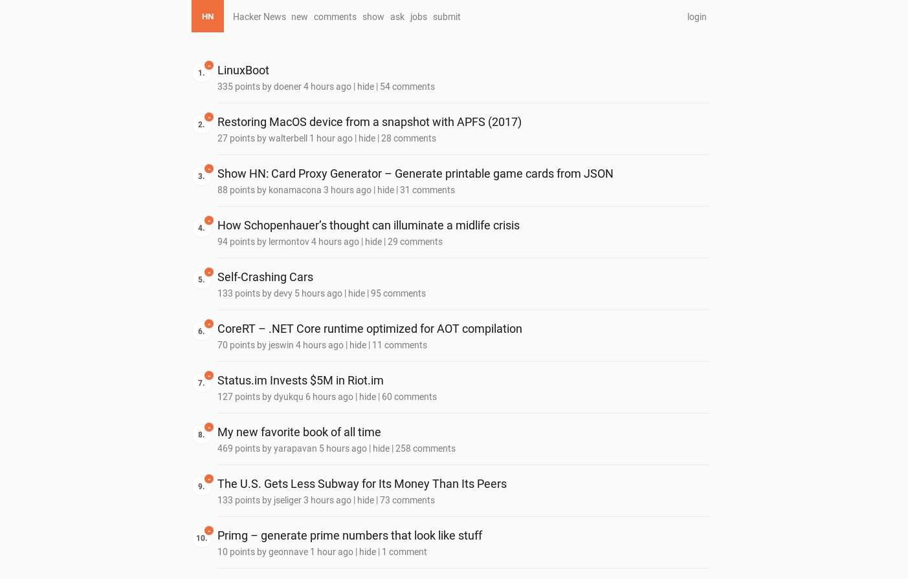

# Modern Hacker News userstyle for Stylus

It's not a secret that [Hacker News](https://news.ycombinator.com) is a bit... dated at this point. I love reading it, I love the links, but man it brings me back to the 90's. This userstyle aims to restyle the original interface with a more modern one.

## Installation

1. Install the [Stylus](https://add0n.com/stylus.html) extension for Chrome, Firefox or Opera.
2. Browse to either the [light](https://userstyles.org/styles/133201/hacker-news-readable) or dark theme on [userstyles.org](https://userstyles.org) and install it.
	- You may alternatively install either theme manually with Stylus by going to `Manage > Write new style > Import` and copy pasting the code from either respective [light](hacker-news-readable-light.css) or [dark](hacker-news-readable-dark.css) `.css` file.
3. Give the style a name, e.g. `Hacker News Readable (Light)` or `Hacker News Readable (Dark)`.
