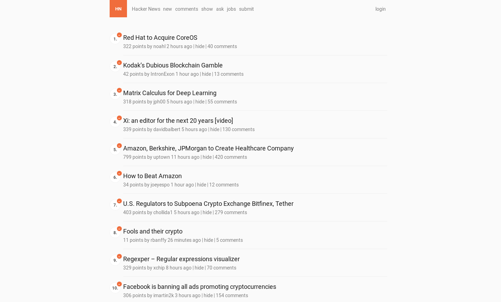
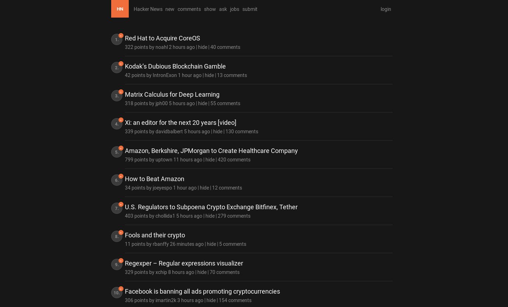

# Modern Hacker News Userstyle

Forked from https://github.com/Gigacore/hackernews-userstyles.

&nbsp;

## Installation

1. Install the [Stylus](https://add0n.com/stylus.html) extension for Chrome, Firefox or Opera.
2. Install either theme by clicking either [light](https://raw.githubusercontent.com/losuler/hacker-news-userstyle/master/modern-hacker-news-light.user.css) or [dark](https://raw.githubusercontent.com/losuler/hacker-news-userstyle/master/modern-hacker-news-dark.user.css) `.user.css` file.
3. Give the style a name, e.g. `Hacker News Readable (Light)` or `Hacker News Readable (Dark)`.
